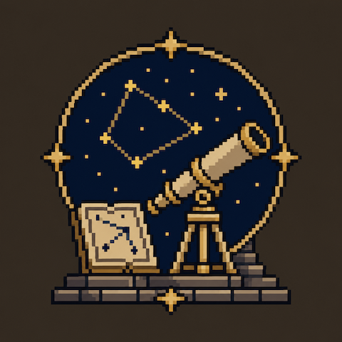
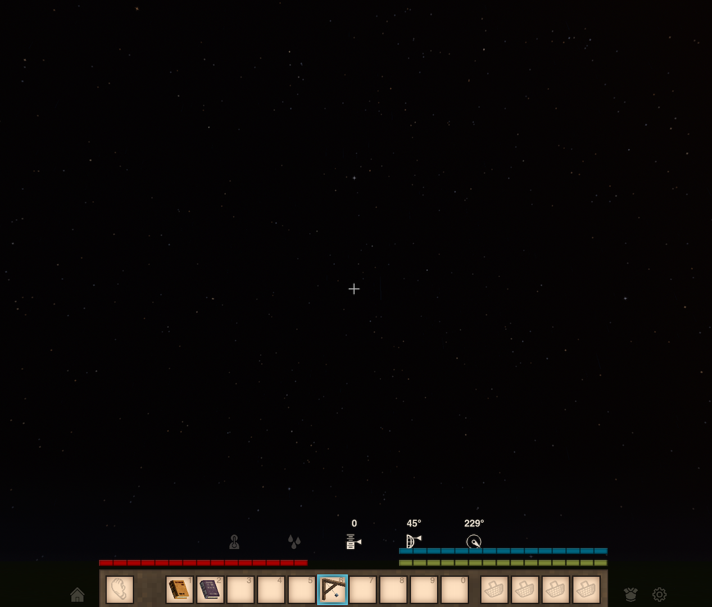
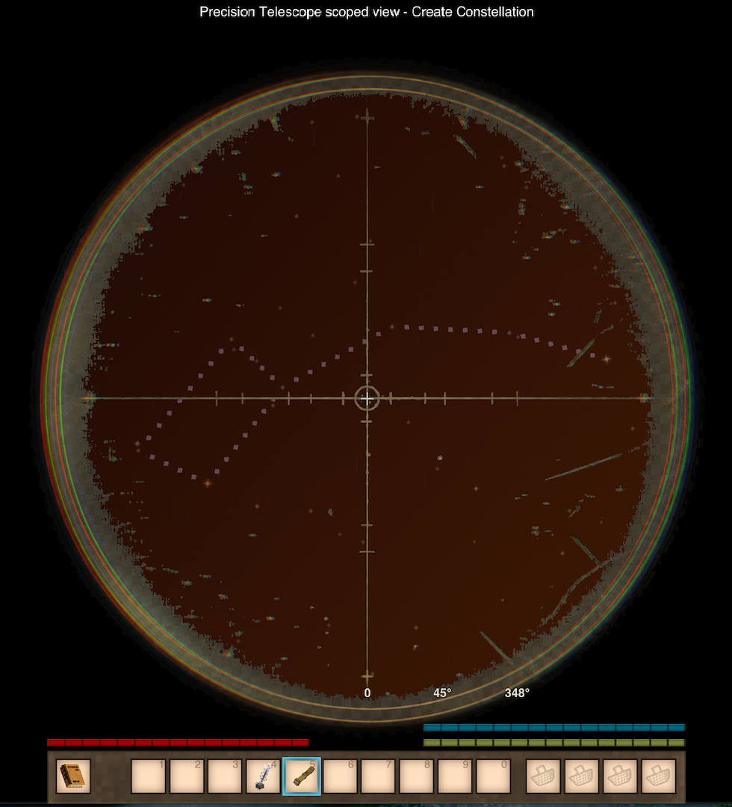
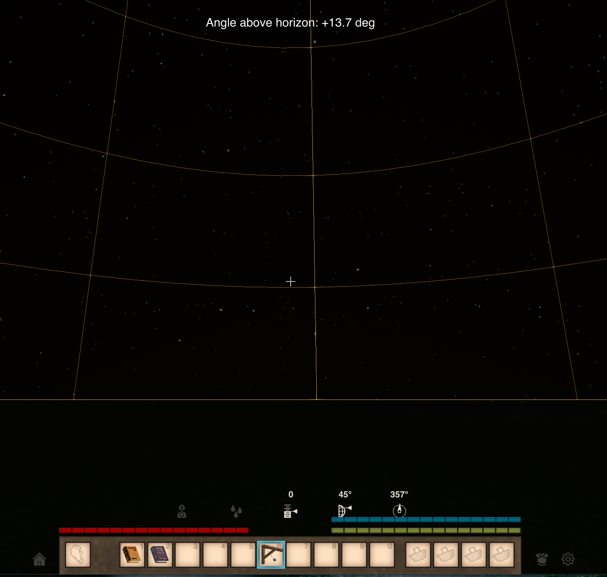
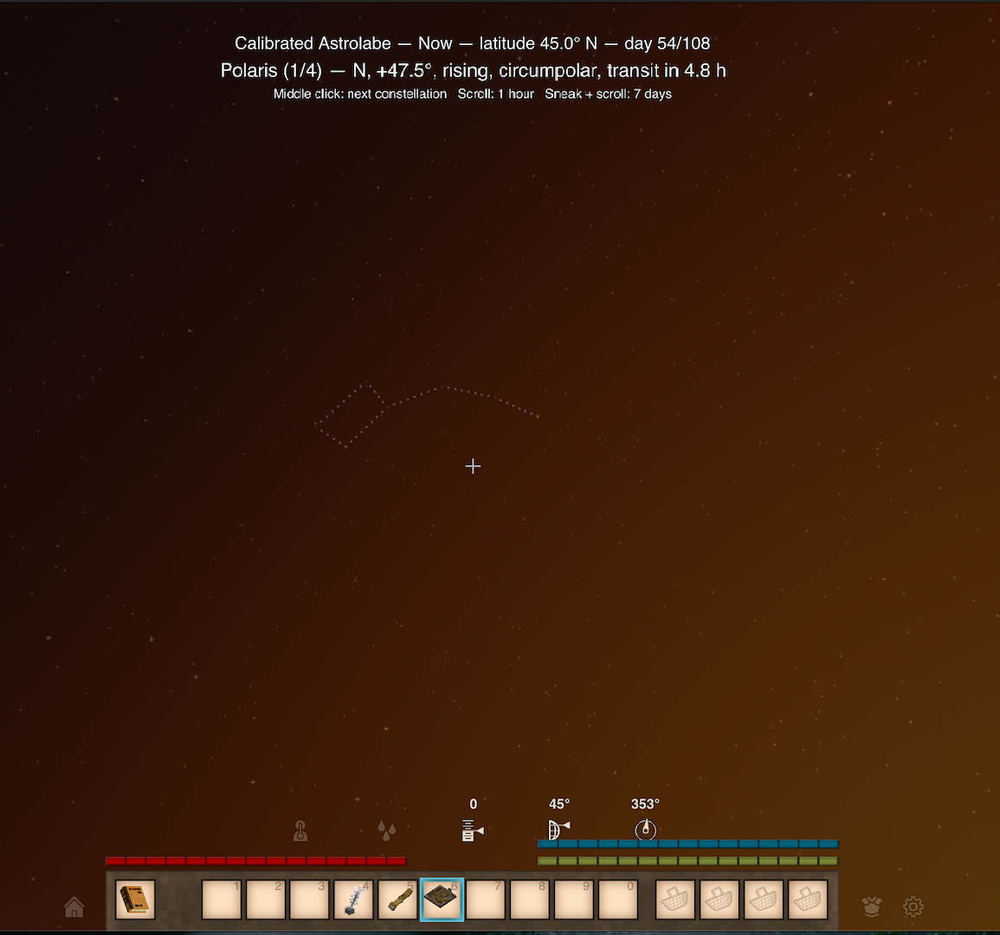
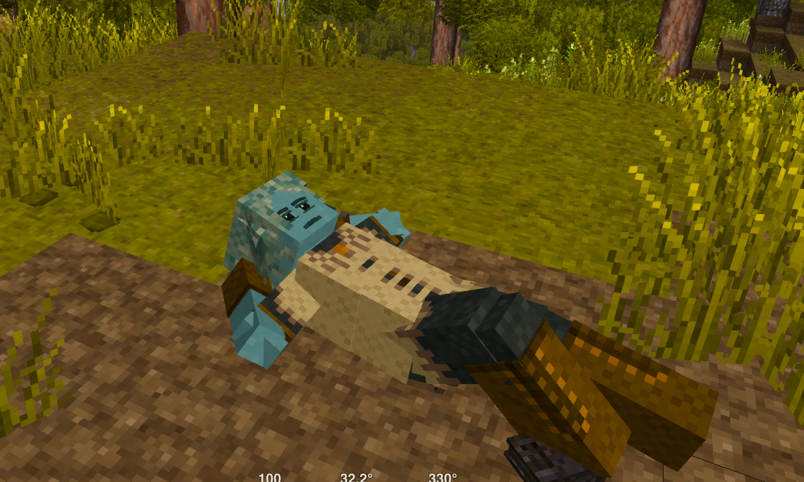

# AstraTerra



AstraTerra replaces Vintage Story's night sky with a catalog of 5,044 stars, 50 deep-sky objects, five planets, nine annual meteor showers, and four returning comets. The sky turns with the hour, changes with the season, and tilts as you travel north or south. Vintage Story 1.22+.

The instruments are the actual game. Mark a year of sunrises on a Sky Disc. Measure a light above the horizon with a Sextant, write the reading down, and work out what moved. Draw constellations into a book through a telescope. Cut an astrolabe plate for your latitude and use your own records to plan another observation.

> AstraTerra is still alpha. Some models, recipes, and bits of UI are placeholders. If a borrowed asset is missing from [the third-party notices](THIRD_PARTY_NOTICES.md), please open an issue so we can fix it.

## v0.9.0: Longitude Update

- World X now acts as longitude. Travel east or west and the sun, daylight, and star field shift together.
- The server still keeps one universal clock. `displayedClockTime` can show `local` solar time, `universal` time, or whole-hour `zones` in the character panel and instruments.
- Set `longitudeAwareSun` to `false` in `ModConfig/astraterra.json` if the server should keep Vintage Story's single time zone.
- The star field now stays aligned with the visible sun on worlds with custom year lengths.
- The moon can use AstraTerra pixel art, photographic textures, or Vintage Story's original disc.

## The sky



The catalog is generated from HYG v4.2, with required figure stars retained past the usual magnitude cutoff. Apparent magnitude controls their brightness and size. Fifty Stellarium deep-sky plates appear as faint smudges until a telescope resolves them. The Milky Way sits behind the catalog.

Mercury, Venus, Mars, Jupiter, and Saturn move on Keplerian orbits. Nine meteor showers return at fixed parts of the world year. Four comets have their own apparition schedules and tails that point away from the sun. Miss Halley's first pass and the next one is in world year 78. Plan accordingly.

## Instruments

### Sky Disc

Form a clay disc and fire it, or craft one from copper or bronze. Under open sky at sunrise or sunset, sneak and hold right click to scratch the sun's place on the horizon. Keep marking until the band reaches an edge and turns back. The finished band gives the year length, latitude, east or west, and the next solstice.

Right click reads the disc. Scroll turns it. Sneak-right-click the ground to set it down. Clay uses five-degree notches. Metal uses two-and-a-half-degree notches. The first mark binds the disc to that latitude.

Hold the disc up at night and left-drag between stars to cut one connected constellation. Keep loose flint or a knife in the hotbar. Raw clay takes the figure before firing. A fired clay disc will not.

### Telescope and constellation book



Hold right click to use the scope. Scroll changes zoom. Middle click cycles **Observe**, **Create Constellation**, **Inspect Constellation**, and **Remove Segment**. Drawing or editing needs a writable book in the left hand plus ink and quill in the inventory. The lines and names live in that book, so another player can use it.

Planets become discs under magnification. Mars changes apparent size, Saturn has rings, and Jupiter's four Galilean moons move independently. Five of Saturn's moons are also modeled. A moon hidden behind its planet disappears until it comes out the other side.

### Sextant



Hold right click and center the sight on the sun, moon, a star, a planet, a comet, or a near body supplied by another mod. The readout gives altitude above the horizon. Middle click cycles the equatorial and horizontal grids.

Sneak while sighting to write the observation into a book in the left hand. Ink and quill are required. The entry records the angle, bearing, brightness, position, and time, but not the identity of the target. `.stars sightings` groups repeated observations. `.stars classify <set> star|wanderer|comet [name]` records your conclusion.

Sighting the sun currently costs you nothing. A real navigator would use a shade glass.

### Calibrated Astrolabe



Recover a ruined astrolabe and fit it with a brass plate. After dusk, stand under open sky and sneak-hold right click to cut the plate for that latitude. Travel far enough and it asks to be recut.

With a written book in the left hand, hold right click to plan an observation. Middle click changes target. Scroll moves the forecast by an hour. Sneak-scroll moves it by seven days. The readout gives direction, altitude, rising or setting, and next transit. It also says what the answer rests on: your sightings, the stars in a recorded figure, or the comet almanac.

### Lie down



Press **Z** to lie on your back. Move, jump, or press **Z** again to stand. The binding is remappable under **Controls > Lie down**, and the instruments still work while you are on the ground.

## Pictures and other worlds

Pixel art is the default for planets and the moon. Use `.stars solar-system photo` for photographic planet textures. Use `.stars moon pixel|photo|vanilla` for the moon. These settings change pictures, not positions, phases, or orbits.

AstraTerra also exposes a near-body API for worlds that orbit something larger. A companion mod can place a parent planet and sibling moons in the sky, shade them from the real sun direction, and make them valid Sextant targets. [AstraExtera](https://github.com/lalmei/astraextera) uses that API.

## Useful settings

- `.stars calendar full|clock|none` controls how much of Vintage Story's date and hour appears in the character panel. Hide the date if the Sky Disc should earn its keep.
- `.stars starfield astraterra|both|vanilla` selects the catalog sky, both skies for comparison, or Vintage Story's cubemap.
- `.stars sky-grid none|horizontal|equatorial|both` controls the coordinate grid.
- `.stars solar-system pixel|photo` changes planet art.
- `.stars moon pixel|photo|vanilla` changes moon art.
- `.stars render stars|constellations|deepsky|meteors|comets|milkyway|all on|off` toggles individual render paths.

See the [command reference](docs/player/commands.md) for constellation, sighting, admin, and diagnostic commands.

## How we test

Every change goes through tests for the astronomy math, catalogs, instruments, and saved data. CI builds against Vintage Story 1.22.2, packages the same ZIP players install, and builds the docs. Before a release, we deploy that ZIP and work through the in-game checklist after a full restart. The tests catch logic errors. They cannot tell us whether a telescope, moon, animation, or item model actually looks right.

## Docs and development

- [Player Guide](docs/player/guide.md)
- [Command Reference](docs/player/commands.md)
- [Developer Guide](docs/dev/index.md)
- [Issue tracker](https://github.com/lalmei/astraterra/issues)

Build and test:

```bash
make test
make build
make package
make docs-build
```

For an in-game smoke test, run `make deploy`, enable AstraTerra, and follow [Manual Verification](docs/dev/manual-verification.md).

Models, code, documentation, translations, and screenshots are welcome. Rough edges are tracked in the issue list rather than repeated here.

## Attribution

Inspired by Minecraft's [Spyglass Astronomy](https://github.com/Nettakrim/Spyglass-Astronomy/tree/Main).

The Brass Telescope model is adapted from Fuami's MIT-licensed [Spyglass](https://mods.vintagestory.at/spyglass) mod. Modern IAU constellation lines and selected deep-sky assets come from [Stellarium](https://github.com/stellarium/stellarium). The Sextant model transforms and recipe are adapted from the Realistic Surveying package. Full licenses and asset notes are in [THIRD_PARTY_NOTICES.md](THIRD_PARTY_NOTICES.md).

Thanks to LadyLioness of [AdAstra](https://mods.vintagestory.at/show/mod/47577), and to Rythillian, Bin, Fey_Shadow, nuwabi, itsDuskie, Dannyftm, ffish, pollo_frito_22, and LaurieIAU for testing and arguing with the sky.
