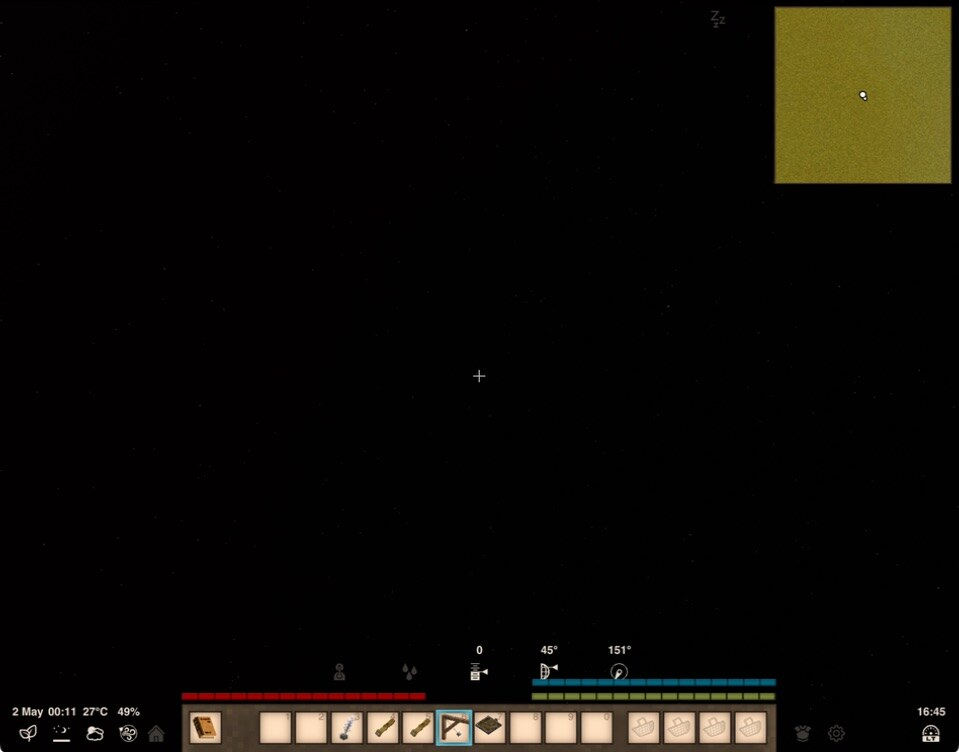
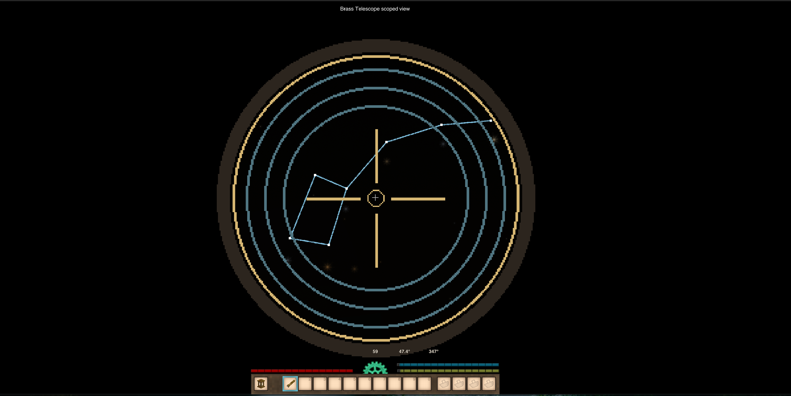

# AstraTerra

AstraTerra turns the night sky into an Earth-focused starfield for Vintage Story 1.22.2. The sky changes with latitude, season, and time; astronomical tools let you observe it, measure it, record your own constellations, and plan when to find them again.

## Features

### An Earth-focused night sky



A catalog of more than 5,000 naked-eye stars replaces the vanilla cubemap with a rotating celestial sphere. Brightness and apparent size follow stellar magnitude, and the visible sky changes as you travel north or south and as the world moves through its year. Deep-sky objects reward careful telescope observation.

### Measure the sky with a Sextant

Hold right click and sight a star to read its angle above the horizon. While sighting, middle click cycles through angle only, the rose equatorial grid, the cyan azimuthal grid, and both grids. The selected overlay lasts for the game session without changing the saved debug-grid preference.

### Plan observations with a Calibrated Astrolabe

Hold a written constellation book in your left hand and use the Calibrated Astrolabe to see a constellation's compass direction, altitude, rising or setting state, next transit, and horizon status. Middle click changes the target; scroll forecasts by an hour, or sneak-scroll by seven days.

### Observe and record constellations



The Brass Telescope provides a scoped observation view with several zoom levels. Draw between guide stars, inspect and name saved patterns, or remove individual segments. Constellations are stored in a written vanilla book, so the same journal can be carried, shared, and read by another player. A stronger Precision Telescope and all 88 authored Modern IAU patterns are also included.

## Docs

Start here:

- [Player Guide](docs/player/guide.md)
- [Command Reference](docs/player/commands.md)
- [Developer Guide](docs/dev/index.md)
- [Docs Index](docs/index.md)

## Build And Test

```bash
make test
make build
make package
make docs-build
```

For local in-game smoke testing:

```bash
make deploy
```

Then enable AstraTerra in Vintage Story and follow [Manual Verification](docs/dev/manual-verification.md).

## Attribution

Inspired by Minecraft's [Spyglass Astronomy](https://github.com/Nettakrim/Spyglass-Astronomy/tree/Main).

The Brass Telescope item model is adapted from Fuami's MIT-licensed [Spyglass](https://mods.vintagestory.at/spyglass) mod. Modern IAU constellation line data and selected deep-sky assets are adapted from [Stellarium](https://github.com/stellarium/stellarium) sources. The Sextant item model transforms and recipe are adapted from the user's downloaded Realistic Surveying package. See `THIRD_PARTY_NOTICES.md`.

Special thanks to Vintage Story Mod [AdAstra's](https://mods.vintagestory.at/show/mod/47577) LadyLioness.
