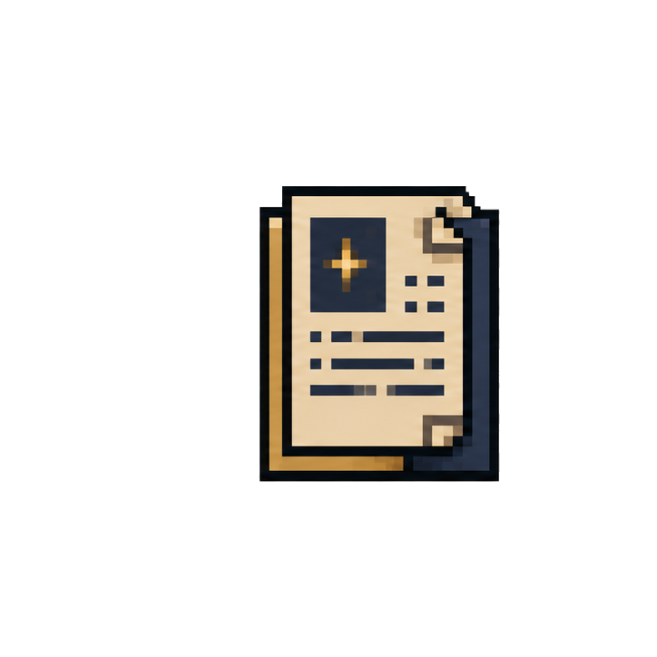
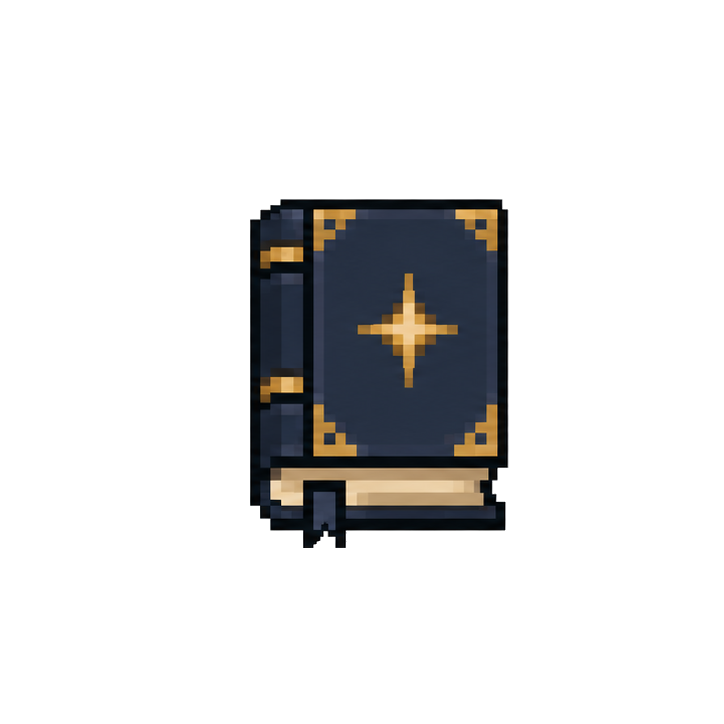
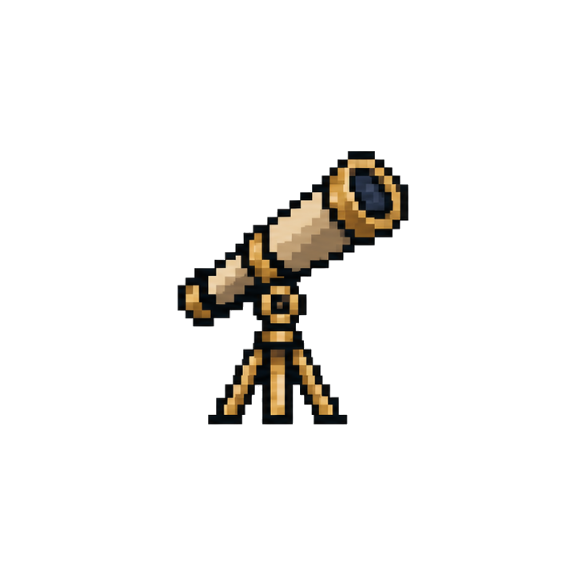
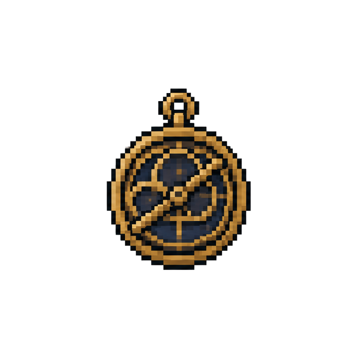
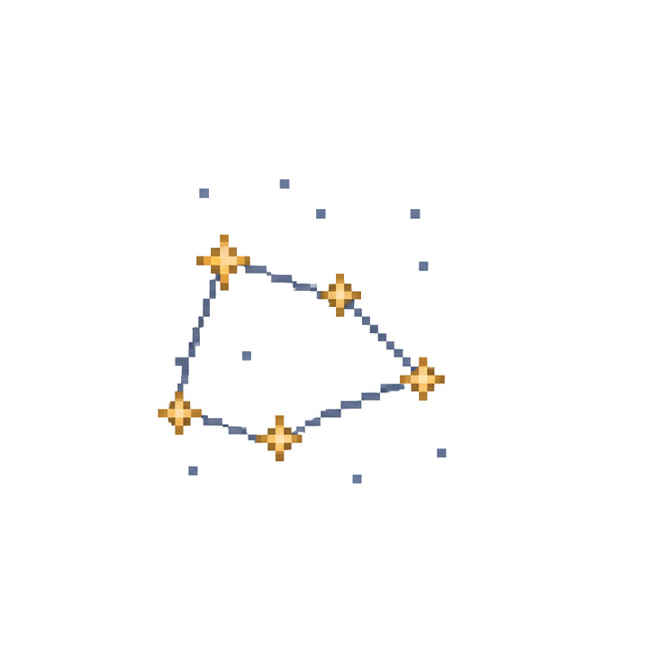

# AstraTerra Docs

AstraTerra turns Vintage Story's night sky into an 5000+ Earth centered starfield with telescope observation, constellation journaling, deep-sky sights, and a sextant readout.

  <a href="player/guide/#constellation-journal">
    
    Chart the sky
  </a>
  <a href="player/guide/#constellation-journal">
    
    Keep a journal
  </a>
  <a href="player/guide/#brass-telescope">
    
    Observe
  </a>
  <a href="player/guide/#calibrated-astrolabe">
    
    Forecast
  </a>
  <a href="player/guide/#constellation-visibility">
    
    Connect the stars
  </a>

## Player Docs

- [Player Guide](player/guide.md): what AstraTerra adds and how to use its instruments.
- [Command Reference](player/commands.md): `.stars` commands for saved constellations and debugging.

## Developer Docs

- [Developer Guide](dev/index.md): build, test, package, and repository layout.
- [Architecture](dev/architecture.md): runtime systems and ownership boundaries.
- [Data Pipeline](dev/data-pipeline.md): committed catalog assets and generation tools.
- [Manual Verification](dev/manual-verification.md): in-game smoke checks before release.
- [Product Scope](dev/product-scope.md): current goals, non-goals, and deferred work.
- [Reference Sky Rendering Notes](dev/reference-sky-rendering-notes.md): findings from local reference sky packages.
